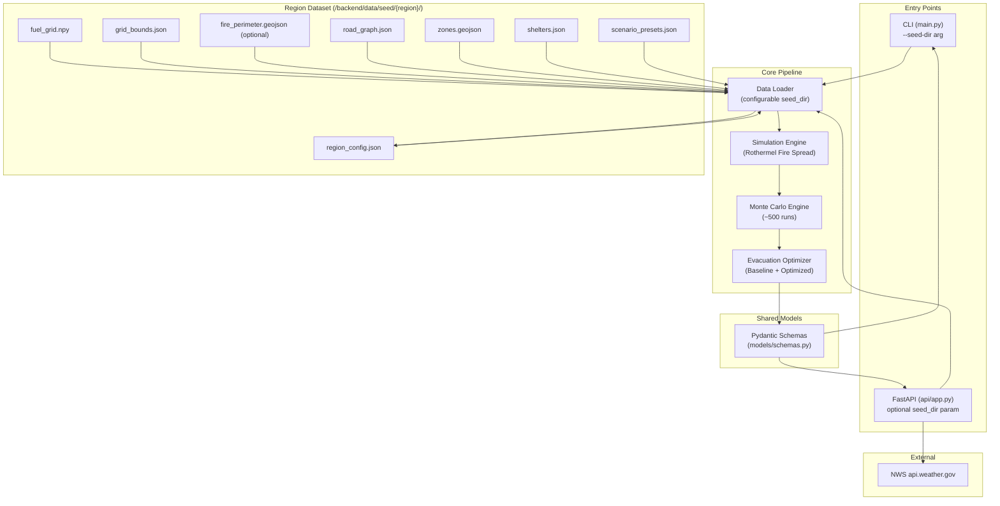
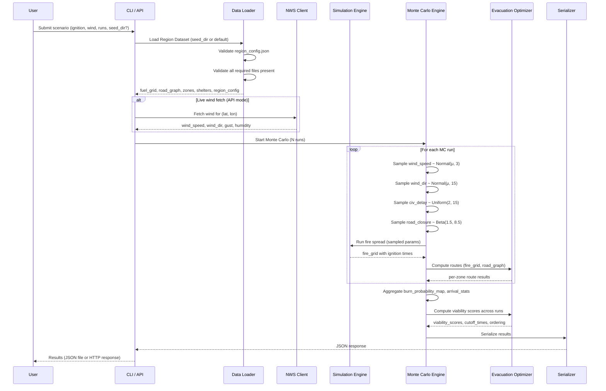

# Design Document — EvacuAI Backend Prototype

## Overview

EvacuAI is a computation-first Python backend that simulates wildfire spread under uncertainty and evaluates evacuation route viability. The architecture is region-agnostic: any geographic region that provides a conformant Region Dataset can be loaded and simulated. Paradise, CA (Camp Fire 2018) ships as the bundled default demo region.

The backend is structured as a pipeline with four stages:

1. **Data Loading** — Ingest a Region Dataset from a configurable directory (fuel grid, road network, zones, shelters, region config) and optionally fetch live wind from NWS.
2. **Fire Simulation** — Run a simplified Rothermel fire spread model on a 2D NumPy grid with 100m cells and 1-minute timesteps.
3. **Monte Carlo Aggregation** — Execute ~500 stochastic simulation runs, sampling wind, delay, and road closure parameters from defined distributions, then aggregate into burn probability maps and arrival time statistics.
4. **Evacuation Optimization** — Compute baseline (Dijkstra shortest-path) and optimized (multi-factor cost function) evacuation routes per zone on a NetworkX road graph, scoring route viability across Monte Carlo runs.

The system exposes two interfaces: a CLI entry point (`python main.py`) for standalone execution and a synchronous FastAPI REST API for frontend integration. Both share the same Pydantic schema definitions and pipeline logic. Both accept a configurable `seed_dir` parameter to specify which Region Dataset to load.

### Key Design Decisions

| Decision | Rationale |
|---|---|
| Synchronous API (no async/celery) | Hackathon scope — simplicity over scalability. ~500 runs on a small grid complete in seconds. |
| NumPy vectorized grid operations | Performance-critical inner loop. Vectorized spread computation avoids Python-level cell iteration. |
| Region-agnostic architecture with configurable seed_dir | Any region providing a conformant dataset can be simulated. Paradise ships as the default. |
| Pre-bundled seed data with single live API call (NWS wind) | Demo reliability — only wind data is fetched live. Everything else is local. |
| Pydantic for all data contracts | Strict validation at API boundaries and CLI output. Shared between API and CLI. |
| NetworkX DiGraph for road network | Standard graph library with built-in Dijkstra. Sufficient for regional road networks. |
| SciPy for stochastic sampling | Provides Normal, Uniform, Beta distributions with seed-based reproducibility. |
| Worldwide lat/lon validation on API | API accepts any valid coordinate; region-specific bounds come from region_config.json at runtime. |

---

## Architecture

### System Architecture Diagram



### Data Flow



---

## Components and Interfaces

### Module Layout

```
/backend
├── main.py                          # CLI entry point (--seed-dir arg)
├── requirements.txt                 # Python dependencies
├── __init__.py
├── simulation/
│   ├── __init__.py
│   └── fire_spread.py               # Rothermel fire spread engine
├── monte_carlo/
│   ├── __init__.py
│   └── engine.py                    # Stochastic MC orchestrator
├── evacuation/
│   ├── __init__.py
│   └── router.py                    # Baseline + optimized routing
├── data/
│   ├── __init__.py
│   ├── loader.py                    # Region Dataset loading & validation
│   ├── wind_client.py               # NWS API client
│   └── seed/                        # Pre-bundled Region Datasets
│       └── paradise-ca/             # Default bundled region
│           ├── region_config.json   # Region metadata & config
│           ├── fuel_grid.npy
│           ├── grid_bounds.json
│           ├── camp_fire_perimeter.geojson
│           ├── road_graph.json
│           ├── zones.geojson
│           ├── shelters.json
│           └── scenario_presets.json
├── api/
│   ├── __init__.py
│   ├── app.py                       # FastAPI application factory
│   └── routes.py                    # Endpoint definitions
└── models/
    ├── __init__.py
    └── schemas.py                   # Pydantic request/response models
```

### Component Interfaces

#### 1. `simulation.fire_spread` — Fire Spread Engine

```python
class FireSpreadEngine:
    """Simplified Rothermel fire spread on a 2D NumPy grid."""

    def __init__(self, fuel_grid: np.ndarray, grid_bounds: GridBounds) -> None:
        """
        Args:
            fuel_grid: float32 array (H, W) with spread rate multipliers 0.0–1.5.
            grid_bounds: Bounding box and cell resolution metadata.
        """

    def run(
        self,
        ignition_point: tuple[float, float],  # (lat, lon)
        wind_speed_mph: float,
        wind_direction_deg: float,
        relative_humidity: float,
        max_timesteps: int = 180,
    ) -> FireSpreadResult:
        """
        Execute one deterministic fire spread simulation.

        Returns:
            FireSpreadResult with burn_mask (bool array), ignition_times (int array),
            and cells_burned count.
        """
```

Key implementation details:
- Grid is a 2D NumPy float32 array. Each cell is 100m × 100m.
- Spread uses 8-neighbor connectivity (Moore neighborhood).
- Per-timestep: for each burning cell, compute spread probability to each unburned neighbor using `spread_rate = R0 * fuel_multiplier * wind_factor * moisture_factor`.
- `wind_factor = exp(0.1783 * wind_speed_mph * cos(angle_between_wind_and_neighbor))` — cosine weighting favors downwind spread.
- `moisture_factor = 1 - (relative_humidity / 100) * 0.8` — higher humidity dampens spread.
- Cells with `fuel_multiplier == 0.0` (non-burnable, FBFM40 codes 91–99) are never ignited.
- Ignition times are recorded as the timestep when each cell first catches fire. Unburned cells get -1.
- Vectorized implementation: use `scipy.ndimage` or manual NumPy slicing to compute neighbor spread probabilities in bulk rather than iterating cells.

#### 2. `monte_carlo.engine` — Monte Carlo Orchestrator

```python
class MonteCarloEngine:
    """Orchestrates N stochastic fire simulation runs."""

    def __init__(
        self,
        fire_engine: FireSpreadEngine,
        road_graph: nx.DiGraph,
        zones: list[Zone],
        shelters: list[Shelter],
    ) -> None: ...

    def run(
        self,
        ignition_point: tuple[float, float],
        wind_speed_mph: float,
        wind_direction_deg: float,
        wind_gust_mph: float,
        relative_humidity: float,
        num_runs: int = 500,
        seed: int | None = None,
        max_timesteps: int = 180,
    ) -> MonteCarloResult:
        """
        Execute N independent simulation runs with stochastic sampling.

        Sampling distributions:
            wind_speed:    Normal(wind_speed_mph, σ=3), clamped to [0, wind_gust_mph]
            wind_direction: Normal(wind_direction_deg, σ=15)
            civ_delay:     Uniform(2, 15) minutes
            road_closure:  Beta(1.5, 8.5) per edge per run

        Returns:
            MonteCarloResult with burn_probability_map, arrival_time_stats,
            per-zone evacuation results, and run metadata.
        """
```

Key implementation details:
- Each run creates a fresh `numpy.random.Generator` from a `SeedSequence` derived from the master seed, ensuring deterministic reproducibility.
- Wind speed is sampled then clamped: `max(0, min(sampled, wind_gust_mph))`.
- Wind direction wraps at 360°.
- Road closure probabilities are sampled once per run and applied to all edges.
- Aggregation: `burn_probability_map[i,j] = count_ignited[i,j] / num_runs`.
- Arrival time stats: mean, median computed only over runs where the cell ignited.

#### 3. `evacuation.router` — Evacuation Route Optimizer

```python
class EvacuationRouter:
    """Computes baseline and optimized evacuation routes."""

    def __init__(
        self,
        road_graph: nx.DiGraph,
        zones: list[Zone],
        shelters: list[Shelter],
    ) -> None: ...

    def compute_baseline_routes(self) -> dict[str, BaselineRouteResult]:
        """Dijkstra shortest-path (min travel_time) to nearest shelter per zone."""

    def compute_optimized_routes(
        self,
        fire_grid: np.ndarray,
        ignition_times: np.ndarray,
        road_closures: np.ndarray,
        civ_delay: float,
        weights: CostWeights | None = None,
    ) -> dict[str, OptimizedRouteResult]:
        """
        Multi-factor cost routing per zone.
        cost = α*travel_time + β*congestion + γ*fire_exposure + δ*road_closure
        Default weights: α=1.0, β=0.5, γ=2.0, δ=1.5
        """

    def compute_viability_scores(
        self,
        mc_results: list[SingleRunResult],
    ) -> dict[str, ViabilityResult]:
        """
        Across all MC runs, compute:
        - Route_Viability_Score: % of runs route succeeds
        - Cutoff_Time: latest start time with >50% viability
        - Failure risk: % of runs with no viable route
        """

    def compute_evacuation_ordering(
        self,
        zones: list[Zone],
        fire_exposure_probs: dict[str, float],
    ) -> list[ZoneOrderResult]:
        """
        Sort zones by priority_score = (pop_weight + elderly_weight*2.0
        + disability_weight*1.5) * fire_exposure_probability.
        """
```

#### 4. `data.loader` — Seed Data Loader

```python
class SeedDataLoader:
    """Loads and validates a Region Dataset from a configurable directory."""

    # Required files that must be present in every Region Dataset
    REQUIRED_FILES = [
        "region_config.json",
        "fuel_grid.npy",
        "grid_bounds.json",
        "road_graph.json",
        "zones.geojson",
        "shelters.json",
        "scenario_presets.json",
    ]

    def __init__(self, seed_dir: str = "backend/data/seed/paradise-ca/") -> None:
        """
        Args:
            seed_dir: Path to the Region Dataset directory. Defaults to the
                      bundled Paradise, CA dataset.
        """

    def load_all(self) -> SeedData:
        """
        Validate and load all Region Dataset files.

        1. Validate region_config.json exists and conforms to schema.
        2. Validate all required files are present.
        3. Load each file with type-specific validation.

        Raises SeedDataError with file path and problem description
        if any file is missing or malformed.

        Returns:
            SeedData containing region_config, fuel_grid, grid_bounds,
            burn_perimeter (if present), road_graph, zones, shelters,
            scenario_presets.
        """

    def load_region_config(self) -> RegionConfig:
        """
        Load and validate region_config.json.

        Validates required fields: region_name, bounding_box,
        default_ignition_point, fire_perimeter_file.

        Raises SeedDataError if file is missing or schema validation fails.
        """

    def validate_required_files(self) -> None:
        """
        Check that all REQUIRED_FILES exist in seed_dir.
        Raises SeedDataError listing all missing files if any are absent.
        """

    def load_fuel_grid(self) -> np.ndarray: ...
    def load_grid_bounds(self) -> GridBounds: ...
    def load_fire_perimeter(self, filename: str) -> np.ndarray:
        """
        Load fire perimeter from the filename specified in region_config.json.
        Args:
            filename: The perimeter GeoJSON filename from region_config.fire_perimeter_file.
        """
    def load_road_graph(self) -> nx.DiGraph: ...
    def load_zones(self) -> list[Zone]: ...
    def load_shelters(self) -> list[Shelter]: ...
    def load_scenario_presets(self) -> list[ScenarioPreset]: ...
```

#### 5. `data.wind_client` — NWS Wind Client

```python
class NWSWindClient:
    """Fetches live wind data from the National Weather Service API."""

    FALLBACK_WIND = WindConditions(
        wind_speed_mph=10.0,
        wind_direction_deg=225.0,  # SW
        wind_gust_mph=20.0,
        relative_humidity=20.0,
    )

    def fetch(
        self,
        lat: float,
        lon: float,
        override: WindConditions | None = None,
    ) -> WindConditions:
        """
        If override is provided, return it directly.
        Otherwise fetch from NWS. On failure, return FALLBACK_WIND and log warning.
        Works for any valid lat/lon worldwide (NWS coverage is US-only;
        non-US coordinates will trigger fallback).
        """
```

#### 6. `api.routes` — FastAPI Endpoints

```python
# POST /api/simulate
@router.post("/api/simulate", response_model=SimulationResponse)
def simulate(request: SimulationRequest) -> SimulationResponse:
    """
    Run full simulation pipeline.
    Accepts optional seed_dir in request body to specify Region Dataset.
    Defaults to bundled Paradise, CA dataset.
    """

# GET /api/wind?lat={lat}&lon={lon}
@router.get("/api/wind", response_model=WindResponse)
def get_wind(lat: float, lon: float) -> WindResponse: ...

# GET /api/scenarios?seed_dir={seed_dir}
@router.get("/api/scenarios", response_model=list[ScenarioPreset])
def get_scenarios(seed_dir: str | None = None) -> list[ScenarioPreset]:
    """
    Return scenario presets from the specified Region Dataset.
    Defaults to bundled Paradise, CA dataset if seed_dir is not provided.
    """
```

#### 7. `main.py` — CLI Entry Point

```python
# python main.py --lat 39.7596 --lon -121.6219 --wind-speed 14 \
#                --wind-dir 225 --humidity 18 --runs 500 \
#                --seed-dir backend/data/seed/paradise-ca/ --output results/
```

Accepts CLI arguments via `argparse`. The `--seed-dir` argument specifies which Region Dataset to load (defaults to `backend/data/seed/paradise-ca/`). Runs the full pipeline and writes JSON output + stdout summary including the region name from `region_config.json`.

---

## Data Models

### Pydantic Schemas (`models/schemas.py`)

```python
from pydantic import BaseModel, Field
from typing import Optional

# --- Region Configuration ---

class BoundingBox(BaseModel):
    """Geographic bounding box for a region."""
    min_lat: float
    max_lat: float
    min_lon: float
    max_lon: float


class DefaultIgnitionPoint(BaseModel):
    """Default ignition point for a region."""
    lat: float
    lon: float


class RegionConfig(BaseModel):
    """Region metadata loaded from region_config.json."""
    region_name: str
    bounding_box: BoundingBox
    default_ignition_point: DefaultIgnitionPoint
    fire_perimeter_file: Optional[str] = None


# --- Request Models ---

class SimulationRequest(BaseModel):
    """Request body for POST /api/simulate."""
    ignition_lat: float = Field(..., ge=-90.0, le=90.0, description="Ignition latitude (worldwide)")
    ignition_lon: float = Field(..., ge=-180.0, le=180.0, description="Ignition longitude (worldwide)")
    wind_speed_mph: float = Field(14.0, ge=0, le=100, description="Wind speed in mph")
    wind_direction_deg: float = Field(225.0, ge=0, lt=360, description="Wind direction in degrees")
    wind_gust_mph: float = Field(20.0, ge=0, le=150, description="Wind gust in mph")
    relative_humidity: float = Field(18.0, ge=0, le=100, description="Relative humidity %")
    num_runs: int = Field(500, ge=1, le=2000, description="Number of Monte Carlo runs")
    max_timesteps: int = Field(180, ge=1, le=1440, description="Max simulation timesteps")
    scenario_preset: Optional[str] = Field(None, description="Named scenario preset")
    seed: Optional[int] = Field(None, description="Random seed for reproducibility")
    seed_dir: Optional[str] = Field(None, description="Path to Region Dataset directory")


# --- Core Data Models ---

class GridBounds(BaseModel):
    """Bounding box and resolution metadata for the simulation grid."""
    min_lat: float
    max_lat: float
    min_lon: float
    max_lon: float
    cell_size_m: float = 100.0
    grid_rows: int
    grid_cols: int


class WindConditions(BaseModel):
    """Parsed wind conditions from NWS or manual override."""
    wind_speed_mph: float
    wind_direction_deg: float
    wind_gust_mph: float
    relative_humidity: float


class Zone(BaseModel):
    """Census block group with population and vulnerability data."""
    zone_id: str
    population: int
    elderly_pct: float
    disability_pct: float
    evacuation_priority_weight: float
    centroid_lat: float
    centroid_lon: float
    geometry: dict  # GeoJSON polygon


class Shelter(BaseModel):
    """Evacuation shelter with capacity and accessibility."""
    shelter_id: str
    name: str
    lat: float
    lon: float
    capacity: int
    accessible: bool


class ScenarioPreset(BaseModel):
    """Named scenario configuration."""
    name: str
    description: str
    ignition_lat: float
    ignition_lon: float
    wind_speed_mph: float
    wind_direction_deg: float
    wind_gust_mph: float
    relative_humidity: float


class CostWeights(BaseModel):
    """Configurable weights for the optimized routing cost function."""
    alpha: float = Field(1.0, description="travel_time weight")
    beta: float = Field(0.5, description="congestion weight")
    gamma: float = Field(2.0, description="fire_exposure weight")
    delta: float = Field(1.5, description="road_closure weight")


# --- Result Models ---

class BurnProbabilityMap(BaseModel):
    """Aggregated burn probability across Monte Carlo runs."""
    grid_bounds: GridBounds
    data: list[list[float]]  # 2D array, values 0.0–1.0


class ArrivalTimeStats(BaseModel):
    """Per-cell arrival time statistics across MC runs."""
    grid_bounds: GridBounds
    mean: list[list[float]]
    median: list[list[float]]
    p10: list[list[float]]
    p90: list[list[float]]


class RouteResult(BaseModel):
    """A single evacuation route."""
    route_id: str
    zone_id: str
    shelter_id: str
    path_coords: list[tuple[float, float]]  # (lat, lon) pairs
    node_ids: list[int]
    total_travel_time_min: float
    viability_score: Optional[float] = None  # % of MC runs route succeeds
    strategy: str  # "baseline" or "optimized"


class ZoneResult(BaseModel):
    """Per-zone evacuation results."""
    zone_id: str
    population: int
    evacuation_priority_score: float
    cutoff_time: Optional[int] = None  # latest safe start timestep
    failure_risk_pct: Optional[float] = None
    baseline_route: RouteResult
    optimized_route: Optional[RouteResult] = None
    geometry: dict  # GeoJSON polygon


# --- Response Models ---

class SimulationResponse(BaseModel):
    """Full response for POST /api/simulate."""
    region_name: str
    scenario: str
    num_runs: int
    max_timesteps: int
    wind: WindConditions
    grid_bounds: GridBounds
    burn_probability_map: BurnProbabilityMap
    arrival_time_stats: ArrivalTimeStats
    zone_results: list[ZoneResult]
    evacuation_ordering: list[str]  # zone_ids in priority order
    summary: SimulationSummary


class SimulationSummary(BaseModel):
    """High-level summary statistics."""
    mean_cells_burned: float
    median_cells_burned: float
    simulation_duration_sec: float
    runs_completed: int


class WindResponse(BaseModel):
    """Response for GET /api/wind."""
    conditions: WindConditions
    source: str  # "nws_live", "fallback", or "manual_override"
    forecast_text: Optional[str] = None
```

### Internal Data Structures (not Pydantic — used in computation)

| Structure | Type | Description |
|---|---|---|
| `fire_grid` | `np.ndarray` float32 (H, W) | Current burn state per cell (0.0 = unburned, 1.0 = burning) |
| `ignition_times` | `np.ndarray` int32 (H, W) | Timestep each cell ignited (-1 = never) |
| `fuel_grid` | `np.ndarray` float32 (H, W) | Spread rate multipliers from LANDFIRE |
| `burn_count` | `np.ndarray` int32 (H, W) | Accumulator: how many MC runs ignited each cell |
| `road_graph` | `nx.DiGraph` | Nodes with (lat, lon), edges with travel_time, capacity |

### Seed Data File Formats

#### Region Dataset Directory Structure

Each Region Dataset is a self-contained directory with the following structure:

```
backend/data/seed/{region-name}/
├── region_config.json          # REQUIRED — region metadata
├── fuel_grid.npy               # REQUIRED — spread rate multipliers
├── grid_bounds.json            # REQUIRED — bounding box and cell resolution
├── road_graph.json             # REQUIRED — road network graph
├── zones.geojson               # REQUIRED — population zones
├── shelters.json               # REQUIRED — evacuation shelters
├── scenario_presets.json       # REQUIRED — named scenario configurations
└── {fire_perimeter}.geojson    # OPTIONAL — fire perimeter (filename in region_config)
```

#### File Schemas

| File | Format | Schema |
|---|---|---|
| `region_config.json` | JSON | `{ region_name: str, bounding_box: { min_lat, max_lat, min_lon, max_lon }, default_ignition_point: { lat, lon }, fire_perimeter_file: str \| null }` |
| `fuel_grid.npy` | NumPy binary | float32 array, values 0.0–1.5 |
| `grid_bounds.json` | JSON | `{ min_lat, max_lat, min_lon, max_lon, cell_size_m, grid_rows, grid_cols }` |
| `{fire_perimeter}.geojson` | GeoJSON | FeatureCollection with one Polygon feature (filename from region_config) |
| `road_graph.json` | JSON (NetworkX node-link) | `{ nodes: [{id, lat, lon}], links: [{source, target, travel_time, capacity, highway}] }` |
| `zones.geojson` | GeoJSON | FeatureCollection, each feature has population, elderly_pct, disability_pct, evacuation_priority_weight |
| `shelters.json` | JSON | `[{ shelter_id, name, lat, lon, capacity, accessible }]` |
| `scenario_presets.json` | JSON | `[{ name, description, ignition_lat, ignition_lon, wind_speed_mph, wind_direction_deg, wind_gust_mph, relative_humidity }]` |

#### `region_config.json` Example (Paradise, CA)

```json
{
  "region_name": "Paradise, CA",
  "bounding_box": {
    "min_lat": 39.65,
    "max_lat": 39.90,
    "min_lon": -121.75,
    "max_lon": -121.40
  },
  "default_ignition_point": {
    "lat": 39.8103,
    "lon": -121.4377
  },
  "fire_perimeter_file": "camp_fire_perimeter.geojson"
}
```

---

## Correctness Properties

*A property is a characteristic or behavior that should hold true across all valid executions of a system — essentially, a formal statement about what the system should do. Properties serve as the bridge between human-readable specifications and machine-verifiable correctness guarantees.*

### Property 1: Spread Rate Formula Correctness

*For any* valid combination of wind speed (≥0 mph), wind angle (0–360°), relative humidity (0–100%), and fuel multiplier (0.0–1.5), the computed spread rate SHALL equal `R0 * fuel_multiplier * exp(0.1783 * wind_speed * cos(wind_angle)) * (1 - humidity/100 * 0.8)` where R0 = 0.05 km/min.

**Validates: Requirements 1.2, 1.4**

### Property 2: Downwind Propagation Bias

*For any* wind direction and a burning cell with 8 neighbors, the neighbor most aligned with the wind direction (smallest angle between wind vector and cell-to-neighbor vector) SHALL have the highest spread probability, and the neighbor most opposed to the wind direction SHALL have the lowest spread probability.

**Validates: Requirements 1.3**

### Property 3: Non-Burnable Cell Invariant

*For any* fire simulation run on any fuel grid, cells with fuel multiplier 0.0 (non-burnable) SHALL have ignition time -1 after the simulation completes — they must never ignite regardless of wind, humidity, or neighboring fire state.

**Validates: Requirements 1.5**

### Property 4: Ignition Time Consistency

*For any* completed fire simulation run, for all cells in the grid: a cell has `burn_mask[i,j] == True` if and only if `ignition_times[i,j] >= 0`. No cell may be marked as burning with a negative ignition time, and no unburned cell may have a non-negative ignition time.

**Validates: Requirements 1.6**

### Property 5: Monte Carlo Sampling Bounds

*For any* Monte Carlo run with parameters (wind_speed μ, wind_gust, num_runs N):
- All sampled wind speeds SHALL be in [0, wind_gust]
- All sampled civilian delays SHALL be in [2, 15] minutes
- All sampled road closure probabilities SHALL be in [0.0, 1.0]
- Exactly N runs SHALL be executed

**Validates: Requirements 2.1, 2.2, 2.4, 2.5**

### Property 6: Burn Probability Map Bounds

*For any* set of Monte Carlo run results aggregated into a burn probability map, every cell value SHALL be in [0.0, 1.0], and each cell's value SHALL equal the count of runs in which that cell ignited divided by the total number of runs.

**Validates: Requirements 2.6**

### Property 7: Deterministic Seeding

*For any* valid scenario configuration and random seed value, running the Monte Carlo engine twice with the same seed SHALL produce identical burn probability maps, identical arrival time statistics, and identical per-zone evacuation results.

**Validates: Requirements 2.7**

### Property 8: Wind String Parsing Round-Trip

*For any* numeric wind speed value N (≥0, reasonable range), formatting it as `"{N} mph"` and then parsing it back SHALL produce the original numeric value N (within floating-point tolerance).

**Validates: Requirements 4.3**

### Property 9: Baseline Routing Correctness

*For any* road graph with zones and shelters, the baseline evacuation route for each zone SHALL match the Dijkstra shortest path (by travel_time weight) to the nearest shelter, and the reported total_travel_time SHALL equal the sum of travel_time edge weights along the path.

**Validates: Requirements 5.1, 5.2**

### Property 10: Optimized Cost Function Correctness

*For any* edge with attributes (travel_time, congestion, fire_exposure, road_closure) and weight coefficients (α, β, γ, δ), the computed edge cost SHALL equal `α * travel_time + β * congestion + γ * fire_exposure + δ * road_closure`, and fire_exposure SHALL be in [0.0, 1.0].

**Validates: Requirements 5.3, 5.4**

### Property 11: Route Viability Score Aggregation

*For any* route evaluated across N Monte Carlo runs, the Route_Viability_Score SHALL equal `(count of runs where route reaches shelter before fire arrival) / N * 100`, and the score SHALL be in [0, 100].

**Validates: Requirements 5.5**

### Property 12: Cutoff Time Correctness

*For any* zone with a computed viability curve over timesteps, the Cutoff_Time SHALL be the latest timestep T such that starting evacuation at T yields a Route_Viability_Score > 50%, and starting at T+1 yields a score ≤ 50%.

**Validates: Requirements 5.6**

### Property 13: Evacuation Ordering Sorted by Priority

*For any* list of zones with computed priority scores, the evacuation ordering SHALL be sorted in descending order of `priority_score = (pop_weight + elderly_weight * 2.0 + disability_weight * 1.5) * fire_exposure_probability`.

**Validates: Requirements 5.7**

### Property 14: Simulation Output Serialization Round-Trip

*For any* valid SimulationResponse object, serializing to JSON and then deserializing back SHALL produce an equivalent data structure with all fields preserved (burn probability map values, arrival time statistics, route coordinates, zone properties, region_name).

**Validates: Requirements 10.5**

### Property 15: Region Dataset Validation Completeness

*For any* directory with an arbitrary subset of the required Region Dataset files (region_config.json, fuel_grid.npy, grid_bounds.json, road_graph.json, zones.geojson, shelters.json, scenario_presets.json), the SeedDataLoader validation SHALL raise an error listing exactly the missing files when any required file is absent, and SHALL succeed when all required files are present.

**Validates: Requirements 11.1, 11.4, 11.5**

### Property 16: Region Config Schema Validation

*For any* JSON object, the RegionConfig validator SHALL accept it if and only if it contains all required fields (region_name as string, bounding_box as object with min_lat/max_lat/min_lon/max_lon as floats, default_ignition_point as object with lat/lon as floats, fire_perimeter_file as string or null). Invalid objects SHALL produce a descriptive validation error.

**Validates: Requirements 11.3, 11.6**

### Property 17: Worldwide Coordinate Acceptance

*For any* latitude in [-90.0, 90.0] and longitude in [-180.0, 180.0], the SimulationRequest Pydantic validator SHALL accept the coordinates. *For any* latitude outside [-90.0, 90.0] or longitude outside [-180.0, 180.0], the validator SHALL reject the coordinates with a validation error.

**Validates: Requirements 6.2**

---

## Error Handling

### Region Dataset Validation Errors

| Error Condition | Behavior | Error Type |
|---|---|---|
| `region_config.json` missing from seed_dir | Raise `SeedDataError` with seed_dir path and "region_config.json not found" message | Fatal — cannot determine region configuration |
| `region_config.json` malformed or missing required fields | Raise `SeedDataError` with file path and schema validation error details (missing fields, wrong types) | Fatal — cannot configure region |
| Required Region Dataset file(s) missing | Raise `SeedDataError` listing ALL missing files (not just the first) | Fatal — pipeline cannot proceed |
| `fire_perimeter_file` specified in region_config but file not found | Raise `SeedDataError` with expected file path | Fatal — cannot load initial fire state |
| seed_dir path does not exist | Raise `SeedDataError` with path and "directory not found" message | Fatal — no data to load |

### Seed Data Errors

| Error Condition | Behavior | Error Type |
|---|---|---|
| Seed data file malformed (invalid JSON, wrong dtype) | Raise `SeedDataError` with file path and parsing error details | Fatal — pipeline cannot proceed |
| Fuel grid values outside [0.0, 1.5] | Raise `SeedDataError` with value range violation details | Fatal — invalid data |
| Road graph missing required edge attributes | Raise `SeedDataError` identifying missing attributes | Fatal — routing cannot proceed |
| Zone missing required fields | Raise `SeedDataError` identifying the zone and missing fields | Fatal — evacuation scoring cannot proceed |

### NWS Wind Client Errors

| Error Condition | Behavior |
|---|---|
| NWS API returns non-200 status | Log warning, return fallback wind (10 mph, SW/225°, gust 20 mph, humidity 20%) |
| NWS API request times out (>10s) | Log warning, return fallback wind |
| NWS response missing expected fields | Log warning, return fallback wind |
| Wind speed string unparseable | Log warning, use fallback value for that field |
| Manual override provided | Skip API call entirely, use override values |
| Non-US coordinates (NWS has no coverage) | Log warning, return fallback wind |

### Simulation Engine Errors

| Error Condition | Behavior |
|---|---|
| Ignition point outside grid bounds | Raise `ValueError` with coordinates and grid bounds |
| Ignition point on non-burnable cell | Raise `ValueError` — fire cannot start on non-burnable terrain |
| Invalid wind parameters (negative speed, humidity > 100) | Raise `ValueError` with parameter name and constraint |
| Simulation produces no burned cells | Return valid result with zero-count burn map (not an error) |

### Evacuation Router Errors

| Error Condition | Behavior |
|---|---|
| No path exists from zone to any shelter | Mark zone with `failure_risk_pct = 100.0`, `cutoff_time = 0` |
| Road graph is disconnected | Log warning, compute routes only for reachable zone-shelter pairs |
| All routes for a zone are blocked by fire | Report `viability_score = 0.0` for that zone |

### API Layer Errors

| Error Condition | HTTP Status | Response |
|---|---|---|
| Invalid request body (Pydantic validation) | 422 | Pydantic error details with field names and constraints |
| Invalid seed_dir (directory not found) | 400 | `{"error": "Region dataset not found", "detail": "Directory {seed_dir} does not exist"}` |
| Region dataset validation failure | 500 | `{"error": "Region dataset validation failed", "detail": "..."}` |
| Seed data loading failure | 500 | `{"error": "Seed data initialization failed", "detail": "..."}` |
| Simulation engine error | 500 | `{"error": "Simulation failed", "detail": "..."}` |
| Wind fetch failure (API mode) | 200 | Returns fallback wind with `source: "fallback"` (not an error to the caller) |

### CLI Error Handling

| Error Condition | Behavior |
|---|---|
| Invalid CLI arguments | Print usage help and exit with code 1 |
| Invalid --seed-dir (directory not found) | Print error message "Region dataset directory not found: {path}" to stderr and exit with code 1 |
| Region dataset validation failure | Print error message listing missing/invalid files to stderr and exit with code 1 |
| Seed data loading failure | Print error message to stderr and exit with code 1 |
| Output directory not writable | Print error message to stderr and exit with code 1 |
| Simulation completes successfully | Write JSON output, print summary (including region name) to stdout, exit with code 0 |

---

## Testing Strategy

### Testing Approach

The testing strategy uses a dual approach:

1. **Property-based tests** — Verify universal correctness properties (Properties 1–17) across randomly generated inputs using `hypothesis` (Python PBT library). Each property test runs a minimum of 100 iterations.
2. **Example-based unit tests** — Verify specific scenarios, edge cases, integration points, and output format compliance using `pytest`.

### Property-Based Testing Configuration

- **Library**: [Hypothesis](https://hypothesis.readthedocs.io/) for Python
- **Minimum iterations**: 100 per property (via `@settings(max_examples=100)`)
- **Tag format**: `# Feature: evacuai-backend-prototype, Property {N}: {title}`
- **Location**: `backend/tests/test_properties.py` (or split by module)

### Property Test Plan

| Property | Module Under Test | Generator Strategy |
|---|---|---|
| P1: Spread rate formula | `simulation.fire_spread` | Random (wind_speed, angle, humidity, fuel_multiplier) tuples |
| P2: Downwind bias | `simulation.fire_spread` | Random wind directions (0–360°) |
| P3: Non-burnable invariant | `simulation.fire_spread` | Random fuel grids with some 0.0 cells, random scenarios |
| P4: Ignition time consistency | `simulation.fire_spread` | Random scenarios on small grids |
| P5: MC sampling bounds | `monte_carlo.engine` | Random (wind_speed, gust, num_runs) tuples |
| P6: Burn probability bounds | `monte_carlo.engine` | Random sets of binary burn masks |
| P7: Deterministic seeding | `monte_carlo.engine` | Random scenarios with random seeds |
| P8: Wind string parsing | `data.wind_client` | Random float values formatted as "{N} mph" |
| P9: Baseline routing | `evacuation.router` | Random small graphs with zones and shelters |
| P10: Cost function | `evacuation.router` | Random edge attributes and weight coefficients |
| P11: Viability score | `evacuation.router` | Random boolean arrays (route success per run) |
| P12: Cutoff time | `evacuation.router` | Random monotonically decreasing viability curves |
| P13: Evacuation ordering | `evacuation.router` | Random zone lists with random priority data |
| P14: Serialization round-trip | `models.schemas` | Hypothesis builds for SimulationResponse |
| P15: Region dataset validation | `data.loader` | Random subsets of required files in temp directories |
| P16: Region config schema | `models.schemas` | Random JSON objects with varying field presence/types |
| P17: Worldwide coordinate acceptance | `models.schemas` | Random lat/lon values inside and outside valid ranges |

### Unit Test Plan

| Test Area | Tests | Module |
|---|---|---|
| Region config loading | Load region_config.json, verify all fields parsed | `data.loader` |
| Region dataset validation | Missing files detected, all missing files listed | `data.loader` |
| Seed data loading | Load each file type from configurable seed_dir, verify structure and types | `data.loader` |
| Seed data errors | Missing files, malformed JSON, wrong dtypes, invalid region_config | `data.loader` |
| Configurable seed_dir | SeedDataLoader accepts custom path, defaults to paradise-ca | `data.loader` |
| Fire perimeter from config | Perimeter filename read from region_config.json | `data.loader` |
| NWS compass conversion | All 8 compass directions → degrees | `data.wind_client` |
| NWS fallback behavior | API failure → fallback values returned | `data.wind_client` |
| NWS manual override | Override skips API call | `data.wind_client` |
| API endpoint responses | Valid requests return correct schemas | `api.routes` |
| API seed_dir parameter | POST /api/simulate accepts optional seed_dir | `api.routes` |
| API scenarios seed_dir | GET /api/scenarios accepts optional seed_dir query param | `api.routes` |
| API validation errors | Invalid payloads return 422, out-of-range lat/lon rejected | `api.routes` |
| API worldwide coordinates | Lat/lon in [-90,90]/[-180,180] accepted | `api.routes` |
| API CORS headers | CORS middleware present | `api.app` |
| CLI argument parsing | Various arg combinations accepted, including --seed-dir | `main` |
| CLI default region | No --seed-dir defaults to paradise-ca | `main` |
| CLI output format | JSON file written, stdout summary includes region name | `main` |
| Demo region defaults | Paradise region_config.json has correct bbox, ignition point, presets | config |
| Scenario presets | 3+ presets with required fields in paradise-ca | `data.loader` |
| Output serialization | Burn map, arrival times, routes, zones match spec | `models.schemas` |
| SimulationResponse region_name | Response includes region_name field | `models.schemas` |

### Integration Test Plan

| Test | Description |
|---|---|
| Full CLI pipeline (default) | `python main.py --runs 10` produces valid JSON output using Paradise default |
| Full CLI pipeline (custom region) | `python main.py --seed-dir path/to/region --runs 10` loads alternate region |
| Full API pipeline | `POST /api/simulate` with small run count returns valid response |
| API with seed_dir | `POST /api/simulate` with seed_dir loads specified region |
| Wind endpoint | `GET /api/wind` with mocked NWS returns valid WindResponse |
| Scenarios endpoint (default) | `GET /api/scenarios` returns Paradise preset list |
| Scenarios endpoint (custom) | `GET /api/scenarios?seed_dir=path` returns presets from specified region |
| Invalid region dataset | `POST /api/simulate` with invalid seed_dir returns appropriate error |

### Test Dependencies

```
pytest>=7.0
hypothesis>=6.0
pytest-cov>=4.0
httpx>=0.24  # for FastAPI test client
```

### Test Execution

```bash
# Run all tests quietly
pytest -q backend/tests/

# Run property tests only
pytest -q backend/tests/test_properties.py

# Run with coverage
pytest -q --cov=backend --cov-report=term-missing backend/tests/

# Run specific property
pytest -q -k "test_property_15" backend/tests/test_properties.py

# Run region dataset validation tests
pytest -q -k "region" backend/tests/
```
